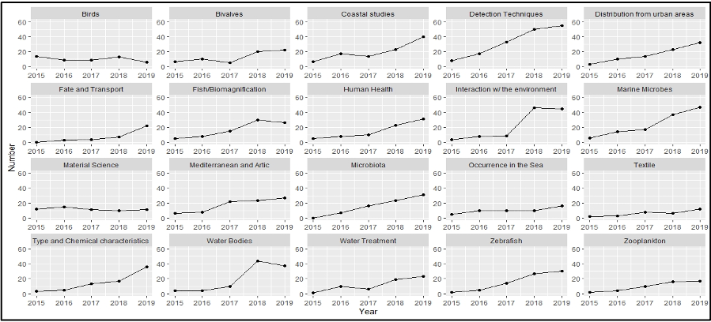
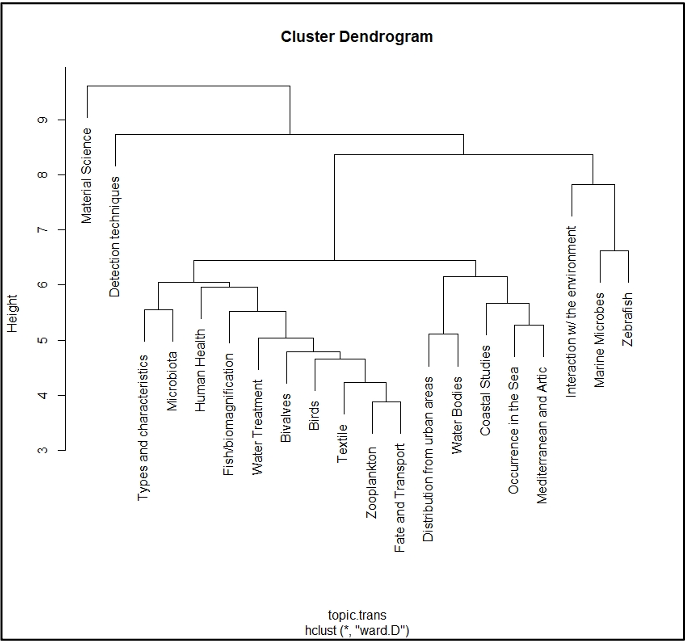
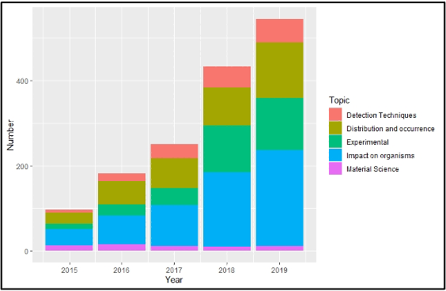
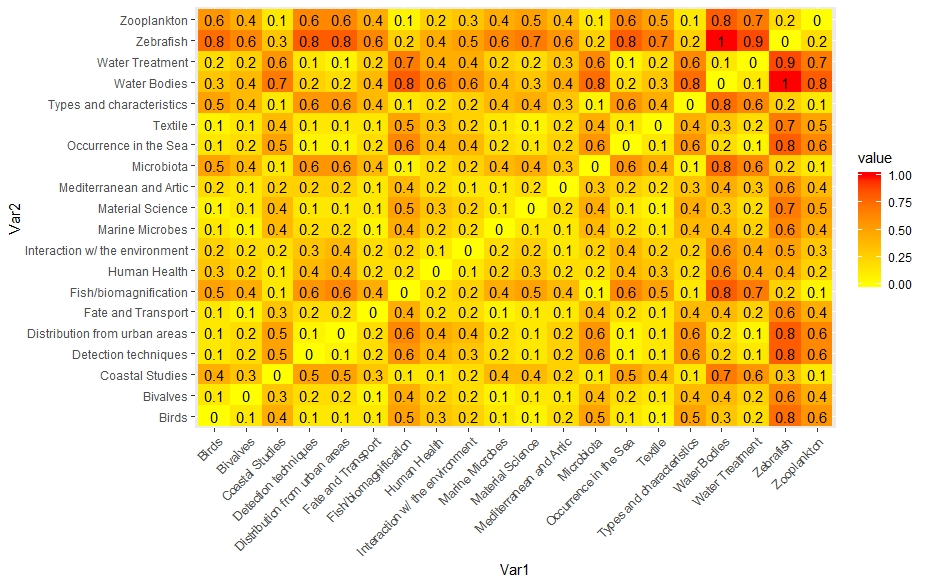

# Microplastics

## Project Goal

I wish to identify the origins and the future direction of microplastics based on current scientific research. 

## Data Source 

I obtained the microplastics scientific articles from https://www.scopus.com/home.uri. Thankfully I was able to access to thousands of scientific article with my student university account. 1600+ scientific article were downloaded using the informational search query "Microplastics".

## Data Description 

This dataset consists of different journals from multiple field of studies ranging from environmental science to material science. 

### Figure 1. The growth trends in microplastics literature per subject area. The growth of microplastics journal literature published for each subject area in the micropastics global literature from 2015 to 2019
-----------------------------------

### Figure 2. Topic-based similarity among microplastics literature. The LDA matrix of weight of each word within each topic was used to calculate the Euclidean distance to determine topic similarity of the microplastics research
-----------------------------------

### Figure 3. Publication output trends on microplasitcs literature by year. The bar colours corresponds to the five broad topic groups as identified using hierachical cluster analysis. 
-----------------------------------

### Figure 3. Knowledge gaps between identified topics in global microplastics literature. The higher the metric means high correlation to the words between the topics 
-----------------------------------

# Conclusion

Text extraction and processing were performed in this project. Text analysis were performed using topic modelling and 20 topics were retrieved from a corpus of 1554 different articles. Hierachical clustering was used to grouped the similar topics together. Lastly, a heatmap was plotted to see the correlation between the different topics. 

# Future work 

I will use Poisson generalized linear mixed model to determine the popular topics and non popular topics in this study's time period. Was thinking of doing sentiment analysis, not too sure if scientific papers will have too much informtion. These tasks will be conduct in the future and will update this repository. 

<!-- I will try and explore unsupervised ML (k-means clustering) for my dataset in the near future  -->
